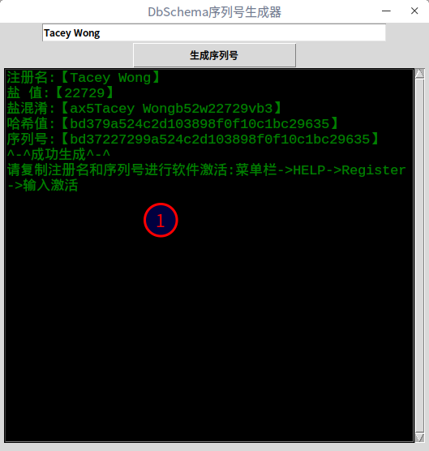
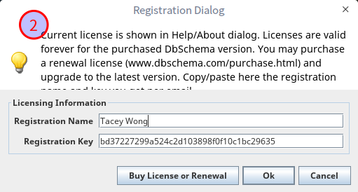
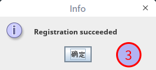
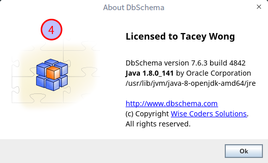

# DbSchema-Keygen 

DbSchema序列号生成器

**仅限于个人用途,不差钱的还是买正版授权比较好**

## 使用


### 免安装

不介意授权名称的，可以使用下面这个授权码：
```bash
用户名:one
序列号:0d6813904c65feaae30325e321b2f29f612c4
```

### Python脚本启动

```bash
$ git clone 
$ cd DbSchema-Keygen
$ python keygen.py
```

### 可执行文件启动

+ linux（下载后注意赋予可执行权限）：
    + GUI版本：[下载](https://github.com/TaceyWong/DbSchema-Keygen/releases/download/v0.1/DbSchema-Keygen-for-linux-GUI)
    + CLI版本: [下载](https://github.com/TaceyWong/DbSchema-Keygen/releases/download/v0.1/DbSchema-Keygen-for-linux-CLI)
+ windows：
    + [下载（尚未打包）]()








